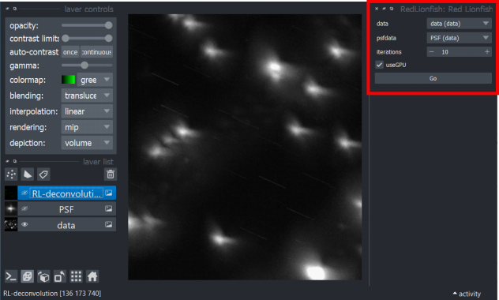
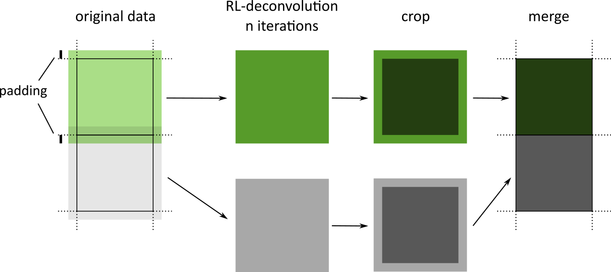

# Summary
Experimental limitations in optics in many microscopy and astronomy instruments result in
detrimental effects in imaging of objects, which can be generally described mathematically
as a convolution of the real object image with the point spread function that characterizes
the system.
The very popular Richardson-Lucy (RL) deconvolution algorithm is widely used for the inverse process,
to restore the data without these optical effects, and this is often an critical restoring step in
data processing of experimental data.
Here we present the versatile RedLionfish python package, that was written to make the RL deconvolution of
volumetric (3D) data easier to run, very fast (by exploiting GPU computing capabilities)
and automatic handling of hardware limitations for large datasets.
It can also be used programmatically in Python/numpy using conda or PyPi package managers,
and is also a simple napari plugin.

# Statement of need

A pseudo-mathematical description of the image formation and restoration begins by considering a situation where user wants to acquire a perfectly sharp snapshot of an object with a camera/detector. Even when optical focus is optimised, there are additional instrumental effects and physical limitations that blur the data and add noise to the measured image. Mathematically, this blurring process can be described being the result of the original image convoluted with the PSF characteristic of the measuring instrument, while the noise is often assumed to be a Poisson noise but it will not discussed. In three-dimensions, the *PSF-blurring* in the measured image can be modelled by:

$$MI(x,y,z) = \int_{V} OI(x_0,y_0,z_0) \cdot PSF(x-x_0,y-y_0,z-z_0) dx_0dy_0dz_0 =  OI \ast PSF $$

with $MI$ being the Measured Image and $OI$ being the Object Image. In discrete form (pixels or voxels) this can be approximated as:
$$MI_{i,j,k} = \sum_{i_0} \sum_{j_0}\sum_{k_0} OI_{i_0,j_0,k_0} \cdot PSF_{i,i_0,j,j_0,k,k_0}$$

where $PSF_{i,i_0,j,j_0,k,k_0}$ is usually a function of $i-i_0$ , $j-j_0$, and $k-k_0$, which then becomes a convolution.

The question is how to reverse the process, and extract the $OI_{i_0,j_0,k_0}$, with experimentally acquired $MI_{i,j,k}$ and known PSF, a process known as *deconvolution*. It is very tempting to try this by using the fourier transform's convolution theorem, namely using the formula $OI = FFT^{-1}\left(\frac{FFT(MI)}{FFT(PSF)}\right)$ . Although this is mathematically correct, the result obtained is often of very poor quality because of the added (unknown) noise in the measured data which is greatly amplified through the division in this formula.
A better solution is to use the Richardson-Lucy iterative algorithm for deconvolution. The Richardson-Lucy (RL) iterative algorithm was developed independently by Richardson [@richardson_bayesian-based_1972] and by Lucy [@lucy_iterative_1974] and by others using maximum-likelihood estimation [@shepp_maximum_1982 ; @holmes_richardson-lucymaximum_1989] is a well proven and documented computational method for improving experimental images or data, which is widely used in microscopy and astronomy [@sarder_deconvolution_2006]. The image/data recovery requires a known point-spread function (PSF, also known as optical transfer function) for executing the mathematical operation of deconvolution. This is a computational algotithm that can be used to suppress the PSF and noise and obtain a good approximation for the object being imaged. Mathematical deduction of the formula takes a probablistic interpretation of the image data, hence the Bayes theorem can be used to calculate the *inverse* operation in probablistic terms. From Richardson article [@richardson_bayesian-based_1972], and renaming variables here, the one-dimensional form of the restorative iteration in its discrete form is:

$$ EI_{n+1,i} = EI_{n,i} \times \sum_{i_0}{ PSF_{i,i_0} \frac{MI_{i_0}}{\sum_{i_1}PSF_{i_1,i_0} \cdot EI_{n,i_1}} }$$

with $n+1$ being the next iteration after $n$.

This formula can be written as convolutions, but it is important to be careful with the PSF indices meaning that in one of the convolutions the PSF data must be *flipped*.

$$ EI_{n+1} = EI_{n} \times \left [ { FSP \ast \frac{MI}{PSF \ast EI_{n}} } \right ]$$

with FSP being the *flipped* form of the PSF discrete data.
This formula is also valid in higher dimensions, maintaining the convolution, PSF flipping and element-wise multiplication. We now focus our discussion here the three dimensional case and how to implement and optimize this calculation.

We first note that each iteration involves the calculation of two convolutions, one multiplication and one division, with the convolution known of being the slowest.
in the two-dimensional case, personal computers nowadays handle these calculations relatively fast, with images with size 1024x1024 taking less than a second per iteration, depending in the computer speed, however three-dimensional data can take significantly longer.
Experimental three-dimensional data is becoming increasingly common
in tomography and light-sheet microscopy being two notable examples.
RL-deconvolution is necessary integral part of the data analysis workflow, but is also quite time-consuming as resource hungry.
As such, fast and reliable RL-deconvolution processing can be very useful.
The convolution calculation is commonly accelerated using the fast fourier transform (FFT). A single convolution calculation involves three FFT (two forward and one inverse) and a multiplication calculation. This is significantly faster than calculating the convolution by suing the sliding PSF method. Despite this algorithmic shortcut, a single iteration of a data volume with 1024x1024x64 pixels, and a PSF of about 64x64x64, running 10 iterations can take up to 10mins.

An additional problem is that the intermediate calculations such as the FFT and other mathematical operations require intermediate storage of the arrays in memory as floating point numbers. With restricted GPU or CPU memory this iterative calculation is likely to throw out-of-memory errors. Access to supercomputers may not be very the most convenient solution sought for a preprocessing filter.

RedLionfish package was created to address most of these difficulties. It is optimised to be fast, by expoiting availability of GPU. It uses PyOpenCL through another package called Reikna which conveniently includes FFT kernels. Since it runs in OpenCL it is also cross-compatible with most CPU's and GPU's, and not restricted to NVIDIA cards. As a failsafe, RedLionfish has also a CPU version of the RL iterative algorithm which is also optimized for speed. To address potential out-of-memory issues in the GPU calculations, the RL deconvolution can run in blocks (or chunks), removing size limitations of the calculation. To facilitate access to this utility, this package has been made widely available in PyPi, in anaconda environments with condaforge, and is a napari [@noauthor_napari_nodate; @sofroniew_naparinapari_2022] plugin.

# Usage

To address different ways that users want to run this deconvolution there are two major options:

1. Napari plugin: Redlionfish package was made into a napari plugin using the MagicGUI. Input requires the image data, the psf, number of iterations and optional GPU usage. It is available in pyton package index (PyPI) which makes it easy to install through the napari plugins, though this is not the recomended installation process, as it may miss PyOpenCL package installation which provide the GPU calculation support. The recommended installation is by using conda, as described in the RedLionfish package webpage. See figure XXXX for a scereenshot
2. Programmatically. By being coded in python, it makes it easy to use programmatically as shown in the example files provided, including jupyter notebooks which is excelent for prototyping. Upon package installation in current python environment, it's accessible using the `import RedLionfishDeconv`. The simplest way to run a RL deconvolution on a numpy 3D data array, with a given PSF is by running the function `doRLDeconvolutionFromNpArrays(data_np , psf_np ,*, niter=10, method='gpu', useBlockAlgorithm=False, callbkTickFunc=None, resAsUint8 = False)`. Other sepcific CPU, GPU or block deconvolution functions are also available. If user requires debugging information in the calculation progress this can enabled by setting `logging.basicConfig(level=logging.INFO)`. The ability to run programmatically also means that it can be included in other packages, such as the correlative image processing software called 3DCT [@arnold_site-specific_2016].

An additional functionality that was added was the ability to monitor calculation progress through a callback method. Full RL-decovolution calculation can take a while to complete and once launched the program may feel like it hang up. An optional callback method can be passed to the calculation that will be used to notify user that a one iteration has completed or, in case of block deconvolution) it has completed processing one block.

# Block deconvolution and the edge problem
It is often desireable to filter large 3D datasets by means of RL-deconvolution, as quick as possible, such as while running an experiment to help locate precise 3D position of beads or cells in light microscopy data, which is required, before proceeding to the next experimental step. GPU can boost proecessing speeds but large datasets may pose a problem for limited GPU memory resources. Redlionfish, by default tries to use default GPU and without chunking data but if out-of-memory error occurs it will attempt to use block deconvolution, whereby the data is split into smaller volumes and the full RL-deconvolution is run independently, and later merged into a single volume [@lee_block-iterative_2015] (\autoref{fig:fig3}). Unfortunately the nature of the deconvolution algorithm requires significant amount data from neighbouring volumes which means that padding must be used and edge-effects from each block may affect the results. This is currently implemented in parameter `psfpaddingfract` (set to 1.2 as default) in function `block_RLDeconv3DReiknaOCL4()` in file `RLDeconv3DReiknaOCL.py`. This parameter sets how much of the relative size of the PSF data, each of the block edges will be cropped and merged to the final result data volume.

It is known in RL-deconvolution that edge errors propagate innwards. Considering the one-dimensional case, using finite width of data ($w_{data}$) and PSF ($w_{PSF}$), and rememebering that there are two discrete convolutions in each iteration of the RL algorithm, the 'valid' region of the reduces by $2w_{PSF}-2$ per iteration. For example, imagine that we can split into blocks of data with width of 512 and our PSF is 32, then a typical 10 iterations would mean that the valid region is reduced to $512-10\times 2(2\times 32 -2) = -108$, meaning that the whole result would be invalid. This would mean that in order to get the highest precision in the RL-deconvolution, the solution would be to run a very low number of iterations, often insuficient to restore data to an acceptable level. In fact, in most cases where RL-deconvolution is used, users do apply several iterations, well beyond the limit established for getting positive size valid regions, and sometimes also using large size PSF's, only to collect the result without bothering to crop the 'valid'-only region. Theoretically the whole result is invalid but despite the reduced precision of using this method, the results obtained are often accepted and used for further analysis. There are ways that the loss of quality can be mitigated, such as using edge normalisation and block-interlacing methods [@lee_block-iterative_2015], that work well in many cases such as with gaussian PSFs and with camera photos, however these are not mathematically correct. The reader is advised to check the repository notebooks examples that conduct deeper analysis of the number of iterations and psf size in reducing the valid region based in a precision criteria. In the blocked processing algorithm, however each block will innevitably experience these edge effects, which may or may not be visible.

Several solutions to mitigate these rapid reduction of the valid region were carefully considered but none of them was considered feasible as it would require significantly higher computer processing and memory consumption. This precision issue will be addressed in future versions at expense of speed in case user requires.

# Social acceptance
This package became instantly popular from the first day it was published as a napari plugin in PyPI, as shared by other scientists on Twitter and discussed in image.sc forum. There are other free software RL-deconvolution solutions available and users are encouraged to try and compare [@sage_deconvolutionlab2_2017; @lambert_pycudadecon_2022; @noauthor_maweigertgputools_nodate; @haase_clij_2020]. RedLionfish combines many good aspects by being user-friendly through napari, it is reasonably fast, it is free and easily available, no crashes regardless, and it simply does the job regardless of your PC.

# Availability
The RedLionfish source code is wrtitten in python is available in github (https://github.com/rosalindfranklininstitute/RedLionfish). It is easily installable in anaconda python environments from conda-forge channel or using pip (PyPI) with the package name being `redlionfish`.

# Acknowledgments
All authors acknowledge funding from Wellcome Trust grants 220526/Z/20/Z and 212980/Z/18/Z.
